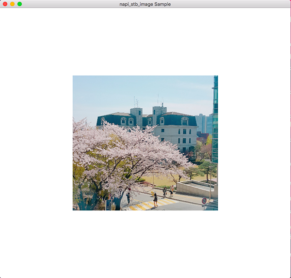

# napi_stb_image

The goal of this library provides [stb_image](https://github.com/nothings/stb/blob/master/stb_image.h) bindings for node using N-API.  

## Supported OS
Currently tested only macOS but will support others soon.

## Installation

```javascript
npm install napi_stb_image
```

## Usage

Create image by stbi_load_from_memory:
```javascript
function create_image(path) {
    let stat = fs.statSync(path);

    let handle = fs.openSync(path, 'r');
    let buf = new Buffer(stat.size);
    let read = fs.readSync(handle, buf, 0, stat.size, null); 
    fs.closeSync(handle);


	let img = STB_Image.stbi_load_from_memory(buf);

    img.obj = VG.vgCreateImage( VG.VG_lABGR_8888, img.width, img.height, VG.VG_IMAGE_QUALITY_BETTER);
    VG.vgImageSubData(img.obj, img.buffer, img.width * 4,  VG.VG_lABGR_8888, 0, 0, img.width, img.height);
    return img;
}
```

Draw image:
```javascript
function draw_image(img, x, y, ww, hh) {
    
    VG.vgSeti(VG.VG_MATRIX_MODE, VG.VG_MATRIX_IMAGE_USER_TO_SURFACE);
    VG.vgLoadIdentity();
    let wscale = ww / img.width;
    let hscale = hh / img.height;
    
    VG.vgTranslate(x,  y);
    VG.vgScale(wscale, hscale);
    
    VG.vgDrawImage(img.obj);
}
```

Screenshot:


